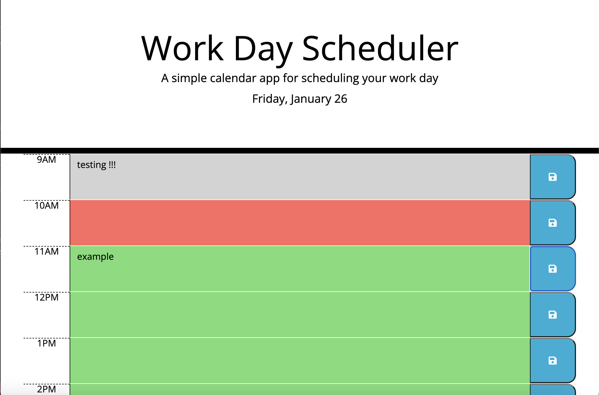
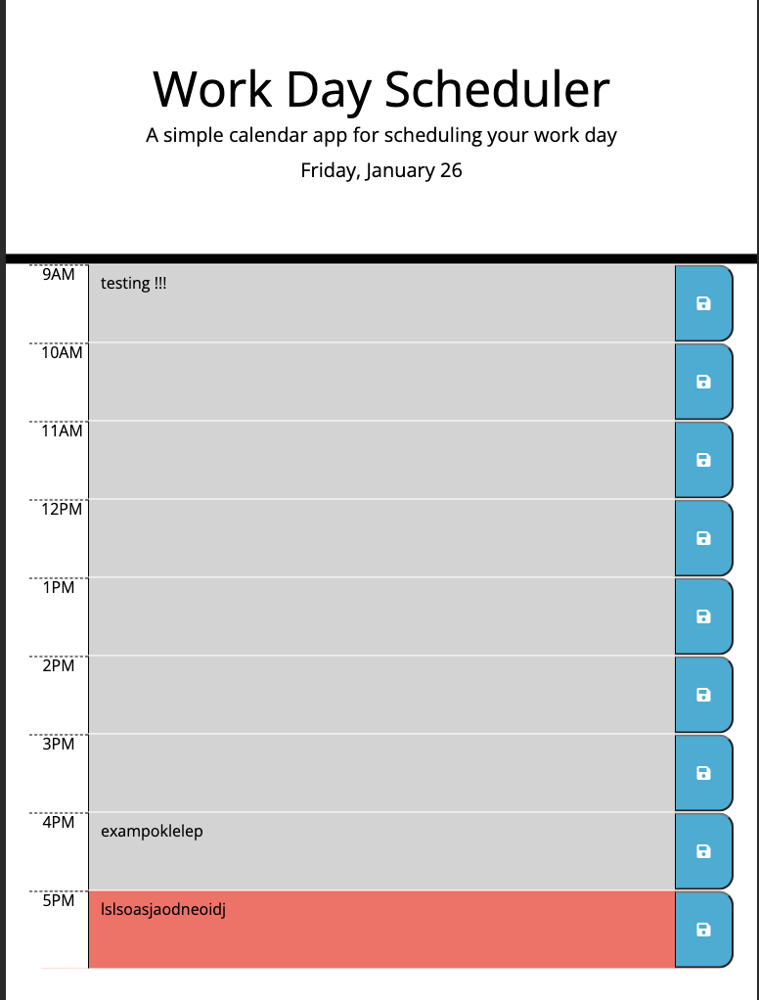

# DailyDally

Daily Dally is a daily planner application built with jQuery, HTML, CSS, and the Day.js API. This application allows users to schedule events for each hour of a working day (09:00 - 17:00).

## Table of Contents
- [Introduction](#introduction)
- [Installation](#installation)
- [Usage](#usage)
- [Features](#features)


## Introduction

This calendar application is designed to help users organise their daily tasks effectively. With the use of Day.js for date and time handling, Daily Dally provides a dynamic and user-friendly experience. The application dynamically updates HTML and CSS based on the current time, making it easy to identify past, present, and future events.

## Installation

To run DailyDally on your machine, follow these steps:

1. Clone the repository to your local machine:
    ```bash
    git clone https://github.com/DanielaDeMoura/DailyDally.git
    ```

2. Open the project folder:
    ```bash
    cd DailyDally
    ```

3. Open the `index.html` file in your preferred browser.

## Usage

- The current date is  displayed at the top of the page.
- Time blocks for each hour, from 9 AM to 5 PM, are provided.
- Enter your event details in the corresponding textarea for each hour.
- Click the save button to store your event locally.
- The background color of each time block indicates whether the event is in the past, present, or future. grey is in the past, red is present, and green is future.

## Features

- **Dynamic Updates:** The application dynamically updates the display based on the current time.
- **LocalStorage:** Events are stored locally, allowing users to continue with their schedule between sessions.
- **Intuitive Interface:** The clear colour-coded timeblocks helps users identify past, present, and future events easily.




